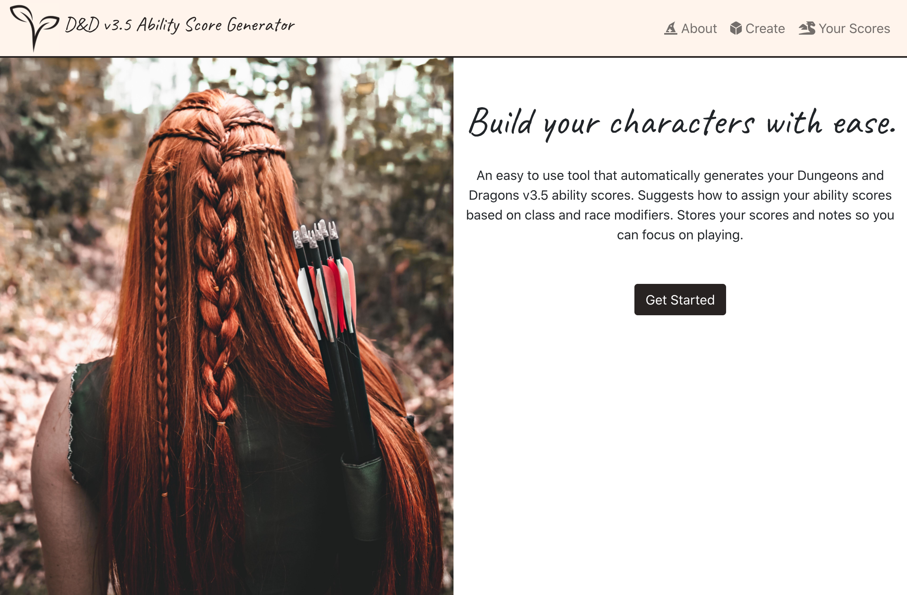
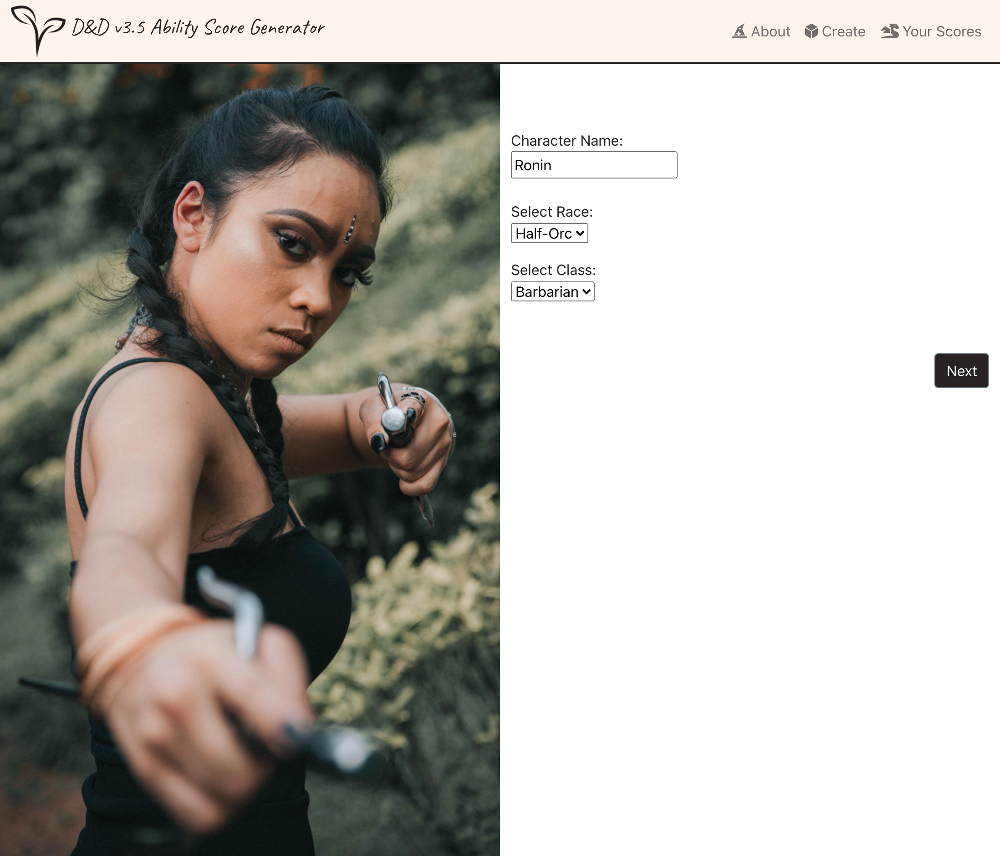
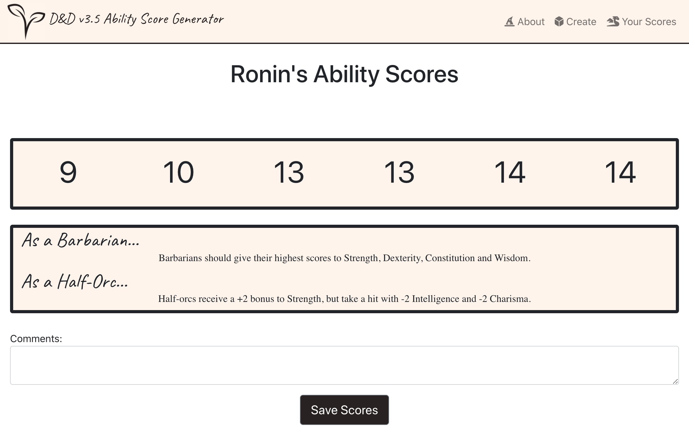

# Ability Score Generator

Calculates ability scores used in Dungeons and Dragons v3.5 and recommends how ability scores should be assigned based on the given character's race and class. Allows for saving scores as well as adding comments and deleting scores.

## Motivation

This generator is a tool that takes care of the essential ability score calculations for Dungeons and Dragons gameplay, allowing a player to more quickly and easily build their characters.  It aims to be simple to use, especially for beginners.

## Installation
* Clone / download ability_score_generator.
* Open the ability_score_generator folder in code editor or terminal.
* Install dependencies with:
```
$ npm install
```
* Once complete, start the server with:
```
$ npm start
```
* Note:  A web browser should automatically open to the ability_score_generator.  If not, you can open a browser and manually navigate to http://localhost:3000/.

## Screenshots







## Acknowledgements

Logo designed with [Adobe Spark](https://www.adobe.com/express/create/logo).

All photos used in this project were obtained from [Pexels](https://www.pexels.com/).  The following photographers' work was used:

* Alvin Ng (https://www.pexels.com/@alvin-ng-1404246)
* Antonio Friedemann (https://www.pexels.com/@toni)
* Thiago Schlemper (https://www.pexels.com/@thiago-s-fotografias)


